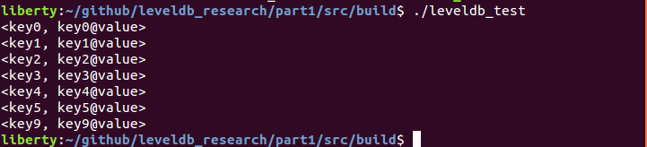
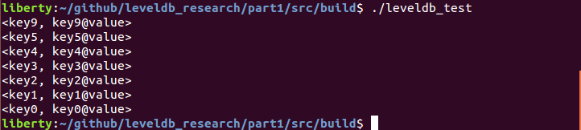

# 根据Key实现降序排序
LevelDB在内存中存储k-v数据时使用`SkipList`, 根据数据的Key进行升序排序. 如果要进行降序, 那么首先要弄清楚`SkipList`如何实现Key的比较.

## `SkipList`如何实现Key的比较？
Key的比较必然发生在添加数据时, 所以可以通过跟踪`Put()`来分析. 跟踪`Put()`最终会来到`SkipList::Insert()`, 继续跟踪到`FindGreaterOrEqual()`->`IsKeyAfterNode()`. 在`IsKeyAfterNode()`内部调用`compare_`的`()`运算符来完成比较(db/skiplist.h, line 257).`compare_`是`SkipList`的成员变量, 类型为模板类型`Comparator`, 所以需要知道模板类型`Comparator`被实例化成的具体类型. 对`SKipList::Insert()`的调用来自`MemTable::Add()`(db/memtable.cc, line 98). `MemTable`的成员变量`table_`是`Table`类型, `Table`是对`SkipList<const char*, KeyComparator>`的类型重定义(db/memtable.h, line 75), 所以`SkipList`的模板`Comparator`被实例化为`KeyComparator`. 在`MemTable`内可以找到结构体`KeyComparator`的定义(db/memtable.h, line 69), 它重载了运算符`()`, 所以之前能在`SkipList::compare_`之上调用`()`实现比较. 查看`KeyComparator`对`()`的实现(db/memtable.cc, line 28), 发现比较操作由`KeyComparator::comparator`成员的`Compare`方法实现.
`KeyComparator::comparator`是`InternelKeyComparator`类型, 它是`Comparator`的子类(db/dbformat.h, line 100). `InternelKeyComparator`在实现`Compare`方法时调用了成员`user_comparator_`的`Compare`方法(db/dbformat.cc, line 48), 这里的`user_comparator_`是`Comparator*`类型, 对该成员的初始化发生在`InternelKeyComparator`的构造函数(db/dbformat.h, line 105).

`SkipList::compare_`被实例化为`KeyComparator`类型, 而对`compare_`的初始化是通过`SkipList`的构造函数完成的(db/skiplist.h line 325). 那么`SkipList`对象是何时被构造的？如前文所述, `MemTable`定义了一个`SkipList`类型的成员`table_`, 对`table_`的构造发生在`MemTable`的构造函数(db/memtable.cc, line 21). 那么`MemTable`又是何时被构造的？回到`MemTable::Add()`调用, 该调用是通过`MemTableInserter`的`MemTable*`类型成员变量`mem_`来完成的(`MemTableInserter`是`WriteBatch::Handler`的子类). 对`MemTable::Add()`的调用来自`WriteBatchInternal::InsertInto()`(db/db\_impl.cc, line 1224), 该函数构造了一个`MemTableInserter`对象并设置其成员变量`mem_`, 并将对象引用传递给`WriteBatch::Iterate()`方法, 然后`WriteBatch::Iterate()`就会调用这个`MemTableInserter`的`Put()`方法, 于是就会调用到`MemTable::Add()`. 至此, 只需要知道`WriteBatchInternal::InsertInto()`的参数`memtable`是从何而来. 显然, 它来自`DBImpl::mem_`, 它的构造发生在(db/db\_impl.cc, line 473等多处), 构造函数的参数是`DBImpl::internal_comparator_`, 而`DBImpl::iterator_comparator_`的初始化发生于`DBImpl`的构造函数. `DBImpl`对象的构造位于`leveldb::DB::Open()`, 是通过`Options`参数实现的. `Options`只提供了不带参数的构造函数, 设置成员变量`comparator`时调用了`ByteWiseComparator()`. `BytewiseComparator()`的实现在(util/comparator.cc, line 70), 用于获得一个`BytewiseComparatorImpl`对象, 最终`SkipList`将用它来完成排序.

## 修改代码
因此, 如果要在`SkipList`内根据Key实现降序排序, 只需要修改`BytewiseComparatorImpl::Compare()`的实现即可(util/comparator.cc, line 27), 这很容易, 只需在返回值前面加一个负号, 如下:
```
int Compare(const Slice& a, const Slice& b) const override {
    return -a.compare(b);
}
```

## 测试
修改前, 数据按照Key升序排列:



修改后重新编译leveldb, 将生成的`libleveldb.a`拷贝到`/usr/local/lib`, 然后重新编译[src/](./src/)下的测试代码, 执行结果符合预期:

