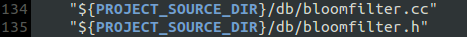
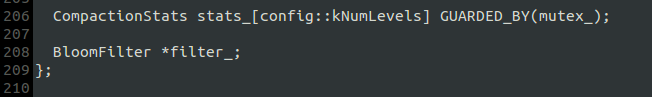
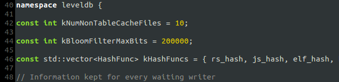
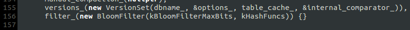
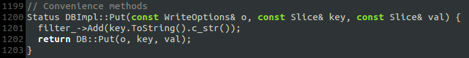
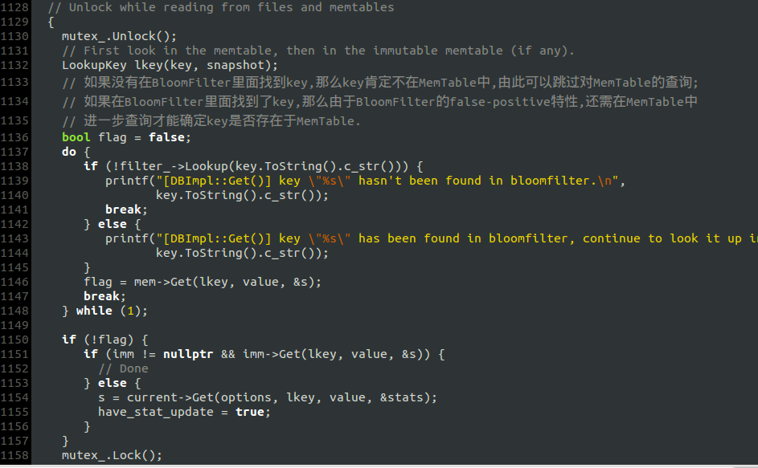
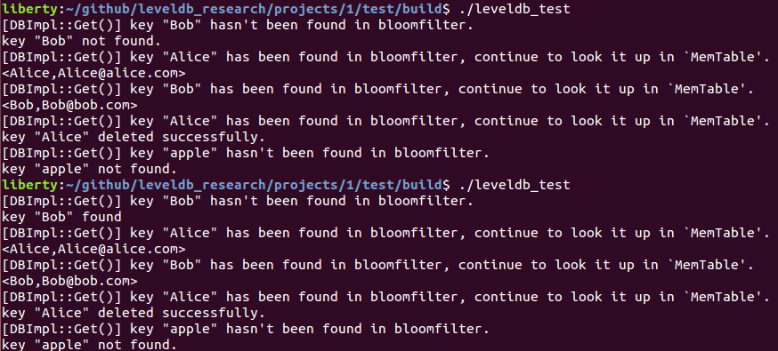

# 思路
创建数据库时建立一个BloomFilter, `Put()`添加KV数据时将key添加到BloomFilter, `Get()`查询KV数据时通过BloomFilter对key进行过滤.

# 源码修改记录
## 实现`BloomFilter`类

将源文件添加到`CMakeLists.txt`:

## 修改`DBImpl`类
### 添加`BloomFilter`成员(`db/db_impl.h`):

### `BloomFilter`相关常量定义(`db/db_impl.cc`):

### 在构造函数中初始化`filter_`, 析构函数中销毁之(`db/db_impl.cc`):

### `Put()`添加KV数据时将key添加到BloomFilter

### `Get()`查询KV数据时通过BloomFilter对key进行过滤

# Build
完成上述修改后将编译的Debug版`libleveldb.a`拷贝到`/usr/local/lib`

# 测试
测试代码在[../test/](../test/)

测试结果如下:

- 第一运行程序时数据库文件`testdb/`不存在, 所以未在数据库中找到`Bob`
- BloomFilter没有持久化, 所以每次打开数据库时都在内存中生成一个新的BloomFilter, 在调用`Put()`把`Bob`添加进数据库前, 无法在BloomFilter中找到它
- BloomFilter不支持删除, 所以`Alice`被从数据库中删除后仍存在于BloomFilter, 进一步查询MemTable, 发现`Alice`被标记为“已删除”

